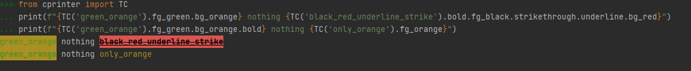

# TerminalColorPrinter
Terminal Color Printer with dot notation for Python (works with any IDE) - no requirements
 Just download cprinter.py and put it in your project folder!

Everything is self explaining: 

